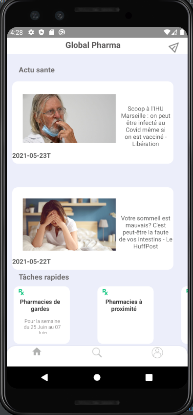
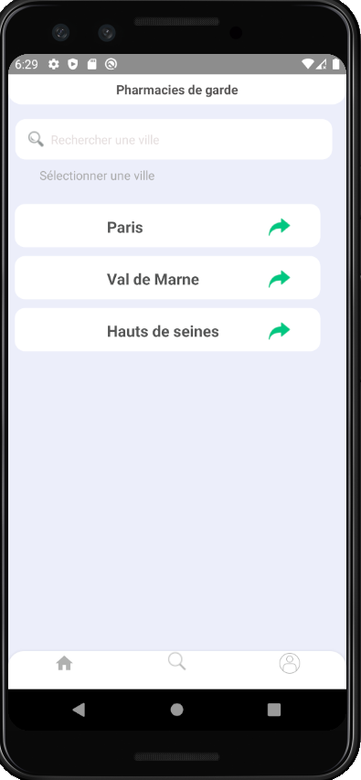
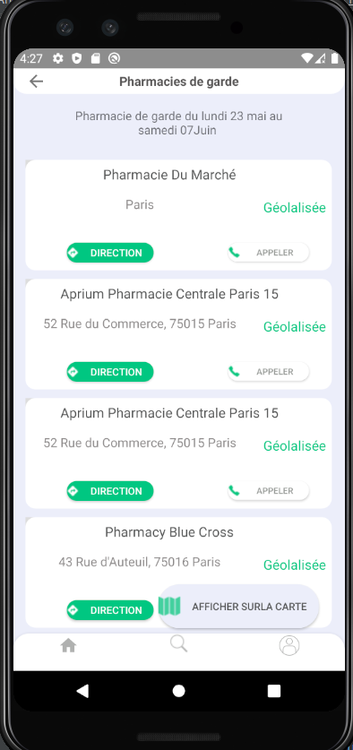

# ProgMobileESIEA2021
Programmation mobile
<h3>Application mobile de géolocalisation de phamarcies de gardes</h3>
<h4>NB: Veillez consulter le fichier indentifiant.txt, pour recuperer les identifiants de connexion</h4>
 
<ul> <strong>Fonctionnalités intégrée</strong>s</ul>
<li>Géolocalisation de pharmacies de gardes en fonction d'une ville</li>
<li>Consultations des actualités santés </li>
<li>Authentification Firebase</li>
 
<ul><strong>Stockage de données</strong></ul>
<li>Base de données : Firebase</li>
<li>SharedPreferences</li>
 
<ul><strong>Architecture utilisée</strong></ul>
<li>Singleton</li>
<li>MVC</li>

<h5><strong>SpalshScreen</strong></h5>

<h5>Page de connexion</h5>

<h5>Page d'acueil</h5>

<h5>Page de détail d'une actualité</h5>

<h5>Pages de géolocalisation</h5>

