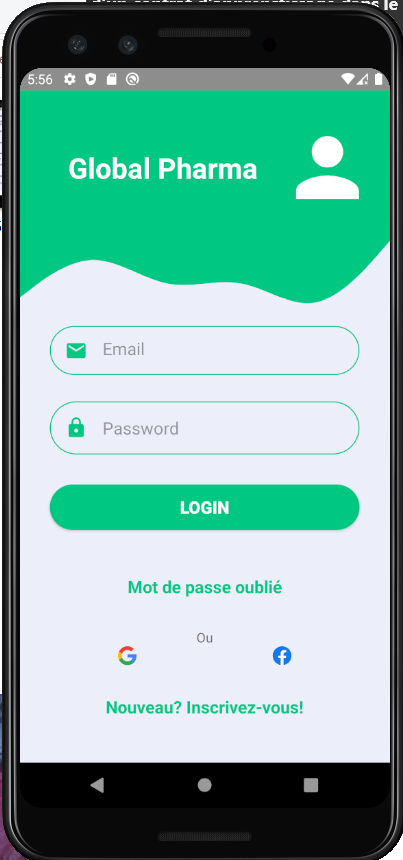

# ProgMobileESIEA2021
Programmation mobile
Application mobile de géolocalisation de phamarcies de gardes

Fonctionnalités intégrées
-Géolocalisation de pharmacies de gardes en fonction d'une ville
-Consultations des actualités santés 
-Authentification Firebase

Stockage de données
-Base de données : Firebase
-SharedPreferences

Architecture utilisée
-Singleton
-MVC

<h5>SpalshScreen</h5>

<h5>Page de connexion</h5>

